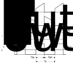

# DC/DC converter

A DC to DC converter is a power electronic system that converts a direct current (DC) source from one voltage level to another. 

## Types of Converters:

-Linear Mode converter

 A linear mode converter uses a resistive voltage drop to regulate the voltage. But there is a loss of power which is voltage times current, in the form of heat. A linear converter generates output voltage is lower than the input voltage.

- Switched Mode Converter
 
 A switching Mode converter uses a switch, an inductor, capacitor and a diode to transfer energy from input to output. Here the input energy is stored temporarily in an inductor and then released to the output at a different voltage. High power conversion efficiency as the switching frequency of the power MOSFET is high and the passive components are small. 

## Types of Switched Mode Converters:

### Non-isolated DC/DC converters:

Here circuit consists of a power switch, an inductor, a diode and a capacitor to transfer the energy from the input to the output. 

- Buck Converter
 
 A switching mode converter generates output voltage which is lower than the input voltage. Very high power efficiency can be achieved with this type convertor 

- Boost Converter

 A switching mode converter generates output voltage which is higher than the input voltage.

- Buck-Boost Converter

 A switching mode converter generates output voltage which is lower than the input voltage depending on the duty cycle.

### Isolated DC/DC converters:

Here circuit consists of a transformer which isolates the input from the output.

- Flyback Converter

 It is similar to the buck-boost convertor but uses a transformer for energy storage. By varying the turns ratio of the transformer, the output voltage can be adjusted. Since the transformer is being used it acts as a storage device and can provide multiple outputs.

- Forward Converter

 It is similar to the buck converter with transformer isolation. The efficiency of the forward converter is same as that of flyback converter but has extra inductor at the output. It is suited for lower power applications.

## Non-Synchronous Non-Isolated Buck Converter:

Normally solar panels have high output voltage compared to battery input voltage hence Non-Isolated buck converter is used as shown in figure 1.

<figure>
 

 
 <figcaption>Fig.1 Non-Synchronous Non-Isolated Buck Convertor</figcaption>
 

</figure> 

### Working Principle

The MOSFET(T1) is an n-channel MOSFET and the diode (D1) is called catch diode or freewheeling diode. The inductor(L) and
capacitor(C) make up the output filter. The capacitor has equivalent series resistance ($R_{ESR}$) and Inductor has DC resistance ($R_L$) is considered. The resistor (R) represents the load seen by the power stage output. During normal operation, T1 is repeatedly switched ON and OFF. This switching action causes a train of pulses at the junction of T1, D1, and L which is filtered by the LC output filter to produce a dc output voltage (Vout).

A power stage can operate in continuous conduction mode or discontinuous conduction mode. In continuous conduction mode, current flows continuously in the inductor during the entire switching cycle. In discontinuous conduction mode, current starts from zero then reaches a peak value and returns to zero during each switching cycle.

### Continuous conduction mode of operation:

In this mode, the power stage works in 2 states (ON and OFF) per switching cycle. The ON state is when T1 is ON and D1 is OFF. The OFF state is when T1 is OFF and D1 is ON. The simplified or equivalent circuit for these 2 states are shown in figure 2

<figure>
 

 
 <figcaption>Fig.2 Equivalent circuit for ON and OFF state of Buck converter</figcaption>
 

</figure>

The duty cycle(D) is given by the ratio of ON time $T_{ON}$ to the one switching period. The duration of the ON state is $DT_s$ and the duration of the OFF state is $(1-D)T_s$ 

<figure>
 

 
 <figcaption>Fig.3 Continuous conduction mode [1] </figcaption>
 

</figure> 

- ON STATE:

 The inductor current $i_L$ flows from input source through $T_1$ to capacitor $C$ and load resistor $R$. The $T_1$ is ON and offers very low resistance ($R_{DSon}$) and voltage drop is given by $i_L \cdot R_{DSon}$. The small voltage drops across $R_L$ and is given by $i_L \cdot R_L$. Diode $D_1$ is OFF during this time because it is reverse biased. The voltage applied across the inductor equals to $V_g – (i_L \cdot R_{DSon}) – (i_L \cdot R_L) – Vout$. During ON time, applied voltage $V_g$ is constant hence the inductor current increases linearly.

 The increase in inductor current is given by 

 $$V_L = L \cdot \frac{di_L}{dt}$$

 $$\Delta i_L = \frac{V_L}{L} \cdot \Delta T$$

 The inductor current increase during the ON state is given by
 $$\Delta i_L (+) = \frac{ V_g – (i_L \cdot R_{DSon}) – (i_L \cdot R_L) – Vout}{L} \cdot \Delta T_{ON}$$

 This quantity $\Delta i_L (+)$ is referred to as the inductor ripple current.

- OFF STATE:

 The $T_1$ is OFF and offers very high impedance from its drain to source. The inductor current $i_L$ flows from ground through $D_1$ to capacitor $C$ and load resistor $R$. The voltage on the left-hand side of inductor becomes $–V_d + i_L \cdot R_L$ where $V_d$ is the forward voltage drop of $D_1$. The voltage applied to the right-hand side of an inductor is still the output voltage $V_{out}$. The applied voltage across inductor equals to $V_{out}+V_d + i_L \cdot R_L$. During OFF time, the applied voltage polarity is negative and constant hence the inductor current decreases linearly.
 
 The inductor current decrease during the OFF state is given by

 $$\Delta i_L (-) = \frac{V_{out}+V_d + i_L \cdot R_L}{L} \cdot \Delta T_{OFF}$$

 This quantity $\Delta i_L (-)$ is referred to as the inductor ripple current.

In steady state conditions, the $\Delta i_L (+)$ during the ON time and the $\Delta i_L (-)$ during the OFF time must be equal. Therefore,

$$V_{out} = \biggl( (V_g - V_{DS}) \cdot \frac{T_{ON}}{T_{ON}+T_{OFF}}\biggl)-\biggl( V_d \cdot \frac{T_{OFF}}{T_{ON}+T_{OFF}}\biggl) - (i_L \cdot R_L )$$

Substituting $T_s = T_{ON}+T_{OFF}$, $D =\frac{T_{ON}}{T_s}$ and $(1-D) =\frac{T_{OFF}}{T_s}$, we get 

$$V_{out} = \bigl( (V_g - V_{DS}) \cdot D\bigl) - \bigl( V_d \cdot (1-D)\bigl) - (i_L \cdot R_L )$$

From the above equation, we can see the output voltage $V_{out}$ can be set by adjusting the duty cycle $D$. The $V_{DS}$, $V_d$ and $R_L$ are assumed to be very small and is equated to zero. Then the output voltage $V_{out}$ is equal to 

$$V_{out} = D \cdot V_g$$

More information on the buck converter operation, please refer [1]

## Synchronous Non-Isolated Buck Converter:

This Synchronous Non-Isolated Buck Convertor as shown in Fig.3 consists of two power MOSFETs, an output inductor and an output capacitor. The name synchronous is because the switching of power transistors is synchronized to provide a regulated output voltage and to prevent the MOSFETs from turning ON at the same time.

<figure>
 

 
 <figcaption>Fig.3 Synchronous Non-Isolated Buck Convertor</figcaption>
 

</figure> 

### Working Principle

The high side MOSFET (T1) is connected directly to the input voltage. When T1 turns ON, the current flow from input to the load through the high side MOSFET. At this time, low side MOSFET (T2) is OFF and the current through the inductor increases, charging the LC filter. When T2 turns ON and current is supplied to the load through the low side MOSFET. At this time, T1 is OFF and the current through the inductor decreases, discharging the LC filter.

The switch voltage is smoothed out by the LC stage which results in regulated DC output voltage. The MOSFETs are controlled synchronous such that the high side and low side MOSFET are not turned ON at the same time which prevents the direct short to ground(shoot-through).

The high side MOSFET on−time determines the duty cycle and is given by:

$$Duty\;Cycle = \frac{t_{ON,HS}}{t_{ON,HS}+t_{OFF,HS}} = \frac{V_{out}}{V_{in}}$$

A duty cycle of 0.5 results in output voltage which is half of the input voltage.

### LC stage

To calculate the values of inductor and capacitor, click <a href="http://schmidt-walter-schaltnetzteile.de/smps_e/smps_e.html#Abw">here</a> 

Inductor($L$) influences the amount of current ripple seen on the inductor current. Inductors have DC resistance ($R_L$)that impacts the performance of the output stage. Minimizing the $R_L$ improves the overall performance of the converter. The $R_L$ is small for lower inductor values but there is a trade-off between inductance and ripple current. The lower the inductance the higher the ripple current through the inductor.

Capacitor(C) directly influences the output voltage of the converter, the response time of the output feedback loop, and the amount of output voltage overshoot that occurs during changes in load current. The higher value of capacitor lower the amount of ripple voltage and lower the output voltage overshoot, but higher the response time for the changes at load.

Capacitors also have a parasitic series resistance, known as the equivalent series resistance ($R_{ESR}$). The $R_{ESR}$ affects the output voltage ripple and the overall efficiency of the converter. Lower the $R_{ESR}$ value higher the performance. The idea to reduce ESR is to use multiple capacitors in parallel.

More information on the LC value selection, Click <a href="https://www.onsemi.com/pub/Collateral/AND9135-D.PDF">here</a>

<header>
    <h1>References:</h1>
</header>

[1] <a href="http://www.ti.com/lit/an/slva057/slva057.pdf"> Understanding Buck Power Stages in Switch mode Power Supplies</a>