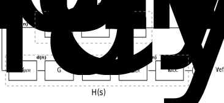

# Digital control 

## Why we need to Control DC/DC converter?

The DC-DC converter inputs are unregulated DC voltage input (Vin) and the required outputs (Vout) should be a constant or fixed voltage (voltage regulation). A control system for the converter is needed to maintain the output voltage of converter constant irrespective of variations in the DC source voltage (Vin) and the load variations.

There are many Analog and Digital control methods used for DC-DC converters which are further classified as Voltage-Mode and Current-Mode control techniques.

## Difference between Voltage Mode Control and Current Mode Control:

Voltage mode and Current mode are the two regulating scenario that can be used to control the output of the converter.

### Voltage Mode Control:

Converter's output voltage remains constant when the current is drawn from zero to full rated current of the converter. Voltage mode control is most basic method, in which the output voltage is sensed and returned through a feedback loop. The sensing of the voltage is easy and typically done using a resistive divider that scales the output voltage to a value which is read by an ADC or directly fed to Analog comparator. The actual output voltage is compared with respect to Reference output voltage and the difference (error) voltage is used to change the pulse width of the PWM signal to control the voltage across the inductor. The controller design is relatively easier as only output voltage is being monitored and hence it requires only one feedback path.

### Current Mode Control:

Current-mode utilises the error between the desired and actual output voltages to control the peak current through the inductor. This mode has fast response compare to that of the voltage mode as the current in the inductor is controlled. Inductor current responds directly with changes in input and output voltages. This mode provides current limiting on a cycle by cycle basis. An advantage of current-mode control is that it eliminates the loop-gain variation with input voltage. First disadvantage of current-mode control, it requires two feedback paths which in turn increase complexity and cost of system. And also instability of the control loop carrying inductor current at duty cycles above 50% is major issue. Second disadvantage, an accurate sensing of current is difficult. For this purpose, very low resistor is placed in series with inductor and voltage drop across this resistor is an indication of the current. The voltage is of milli-volts hence requires amplification.

## Difference between Analog Controller and Digital Controller

An Analog or Digital controller closes the loop around the switching converter and controls the turn ON and OFF states of the switching transistor devices to achieve regulation. 

### Analog Controller:

Figure 1 shows generic analog controller that provides voltage regulation.

<figure>
    

        
        <figcaption>Fig.2 Analog Controller</figcaption>
    

</figure>  

In Analog controllers, UVLO comparator is used whose input is strictly analog and the output is digital signal i.e. either high (1) or low (0).
Depending upon this value the analog PWM increases or decreases the duty cycle of the power stage. But the output of the comparator carries limited information of parameter (i.e whether the monitored value is above or below the threshold value) and does not carry any information regarding the amount of the deviation from the threshold which results in less precise controlling of the parameter.

### Digital Controller:

Figure 2 shows generic digital controller that provides voltage regulation.

<figure>
    

        
        <figcaption>Fig.2 Digital Controller</figcaption>
    

</figure>

This type of controller uses Standard communication block, Processing unit, power management, memory, I/O's and general purpose ADCs. These controllers are not only capable of doing regulation but also can perform complex algorithms to monitor and maintain few parameters within permissible limits.

The three main blocks of this controller are ADC which samples the error voltage with respect to reference voltage, Digital filter which is used to compensate the error and Digital Pulse width modulator which converts compensated signal into Transistor gate drivable signals.

The advantage of the digital controller is the flexibility to decide the right course of action to a given stimuli but at the same time these decisions have to be hardcoded(software) by designer. However, in case of analog controllers, these decisions were made available by the semiconductor manufacturers.

## Modelling the Digital controller 
In order to design controller for any system, it is necessary to have knowledge about system behaviour. This is nothing but mathematical description of the relation among inputs to the process state variables, and output. When we add any digital components into the system, we need consider few effects like feedback quantisation, Control effort quantization, delay involved in sampling the feedback signal and time to calculate the control effort.

Figure 3 shows closed loop block diagram of the digitally controlled DC-DC converter.   

<figure>
    

        
        <figcaption>Fig.3 Closed loop system</figcaption>
    

</figure>  

The closed-loop gain, from the PWM control effort (u) to the sensed output voltage (Vsense) is given by

$$\frac{V_{sense}}{u}=\frac{G(s)}{1+ G(s)H(s)}$$

The total open-loop of gain system is given by

$$T(s)=G(s)×H(s)$$

The parameters that are included in closed loop systems:

| Parameters        |      Description       |
|----------         |:-------------:         |
| KEADC  |   ADC gain in LSB/volt |
| KNLR   |   Nonlinear gain       |
| Gc     | Compensator Gain       |
| Gdelay2| Total sampling time and computational time|
| KPWM   | PWM gain in duty/LSB |
|Gdelay1 | On-time |
|GPlant  | Transfer function of Power stage(at point of falling edge of the PWM signal to Vout)|
|GDiv|Divider network transfer function in V/V|
 
### Plant Modelling Gplant(s): 

Modelling of the Plant can be done using Average model or Discrete time Model. Time domain modelling is necessary in order to know the effects of Quantisation.

#### Average Model:

The effect of variations in input voltage, load current and duty cycle must be considered in time domain model of the system. Normally dc-dc convertor will have non-linear devices hence the system need to be linearized while designing the linear controller. The most common approach is to use Average modelling of the system.

Switch averaging removes the switching ripples in the inductor-current and capacitor voltage waveforms over the switching period. The differential equations for capacitor voltages and inductor currents are obtained and averaging them over each switching interval results in desired average equations. This average equation does not include delay associated with sampling which is done once per switching period. In order to include the delay, equation is modified and is given by :

$$G_{vd-delay}(s) = e^{{t_d}s}G_{vd}(s)$$

Gvd(s) is the control input to output voltage transfer function found using average model and td is the delay between output voltage sampling instance and falling edge of the switching transistor in case of trailing edge modulation. 

For more information please click
<a href="http://www.ti.com/download/trng/docs/seminar/Topic_7_Hagen.pdf">Here</a> 

#### Discrete Model:

An average model does not include the effects of quantization and non-linear gain.

