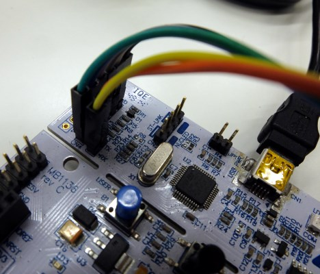
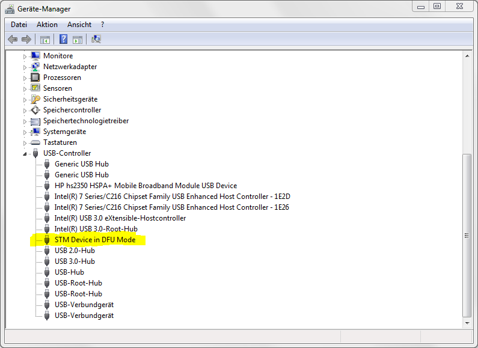
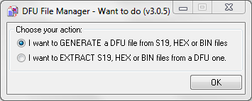
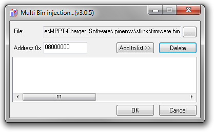
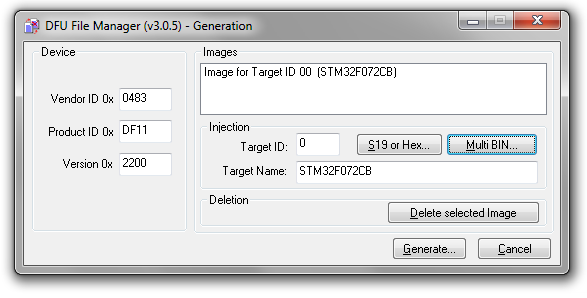
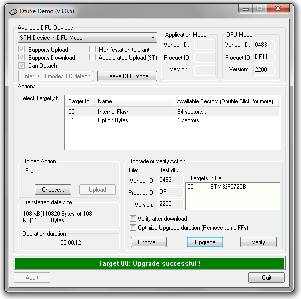

# End-of-line Tests

<table class="tg">
  <tr>
    <td class="tg-yw4l">Material</td>
    <td class="tg-yw42"></td>
  </tr>
  <tr>
    <td class="tg-rmb8">Tools</td>
    <td class="tg-rmb9">Computer, USB-cable, Nucleo board</td>
  </tr>
  <tr>
    <td class="tg-yw4l">Needed Skills </td>
    <td class="tg-yw42">Basic electronics knowledge, computer skills</td>
  </tr>
  <tr>
    <td class="tg-rmb8">Time</td>
    <td class="tg-rmb9">circa 30 minutes</td>
  </tr>
</table>

There are basically two ways to upgrade the firmware of the Libre Solar hardware. For development we recommend to purchase an **STM Nucleo board** with **integrated ST-Link/V2 debug adapter**. The boards are very cheap and allow not only firmware upgrade but also debugging via the serial wire debug (SWD) interface. If you want to upgrade to an already tested new firmware version, you might as well use the **USB interface** which does not need any additional hardware except for a Micro USB cable (the same as used for smart phones).

For both options, you need to install [PlatformIO](http://platformio.org/) (or a different toolchain) and [download the software source code from github](https://github.com/LibreSolar) first.

## Serial Wire Debug (SWD) port via ST-Link/V2

The Libre Solar boards contain a 6-pin header with exactly the same pin-out as the SWD connector on the ST-Link/V2 of the Nucleo boards. In addition to that, you can use the **serial interface** built-in to the Nucleo board to transfer debug information via an additional 2-pin connector.

Before you can flash the software, the device needs to be powered, either via **USB** or the **battery**.

For the **serial wire debug (SWD) interface**, the same pins of the SWD connector of both boards should be connected. The following table gives an overview of the connector pinout:

| Pin function     | Nucleo board   | Libre Solar board   |
|:----------------:|:--------------:|:-------------------:|
| VCC              | SWD pin 1      | SWD pin 1           |
| SWCLK            | SWD pin 2      | SWD pin 2           |
| GND              | SWD pin 3      | SWD pin 3           |
| SWDIO            | SWD pin 4      | SWD pin 4           |
| NRST             | SWD pin 5      | SWD pin 5           |
| SWO (optional)   | SWD pin 6      | SWD pin 6           |

**Important note:** The jumpers at the CN2 connector of the nucleo board have to be removed (see also picture below) in order to flash the external device connected via the SWD connector. Otherwise, the software will be flashed to the integrated MCU.

The **USART serial interface** connection is optional, but very useful during development for sending messages between the device and the computer. The wires have to be connected according the following table:

| Pin function   | Nucleo board     | Libre Solar board   |
|:--------------:|:----------------:|:-------------------:|
| UART serial    | CN3 pin 1 (RX)   | P1 pin 1 (TX)       |
| UART serial    | CN3 pin 2 (TX)   | RX pin 2 (RX)       |

Please note that **TX** and **RX** are crossed between the boards. The receive pin (RX) of one board connects to the transmit pin (TX) of the other board.

The following figures show the location of the connector on the Libre Solar MPPT and the Nucleo board.

<figure>

    
    <figcaption><b>Figure 1.</b> SWD and serial connector MPPT board</figcaption>

</figure>

<figure>

    
    <figcaption><b>Figure 2.</b> SWD and serial connector Nucleo board</figcaption>

</figure>

Now you can press the upload button in your PlatformIO IDE to flash and test the device.

## DFU via USB

**Device Firmware Upgrade (DFU)** is an official USB device class specification. It is natively supported by Linux. For Windows you need to install some drivers as explained below.

### Windows

The Libre Solar boards go into DFU bootloader mode if the reset button is pressed for 3 seconds or longer. After sucessfully loading the bootloader (and after installing the DFU drivers in windows) your device should show up in the hardware manager:

<figure>

    
    <figcaption><b>Figure 3.</b> DFU device in Windows hardware manager</figcaption>

</figure>

Now you need the **DFU File Manager** to generate a DFU file and the **DfuSe tool** to upload your firmware to the device. The tools can be [downloaded on the ST website](http://www.st.com/en/development-tools/stsw-stm32080.html).

Start DFU File Manager and select **I want to GENERATE a DFU file from S19, HEX or BIN files**.

<figure>

    
    <figcaption><b>Figure 4.</b> Generate .DFU file from an .HEX or .S19 file</figcaption>

</figure>

Although not strictly necessary, fill the dialog with the following data to suppress some warnings later on:

* Target Name: **STM32F072CB** (the standard micro used by Libre Solar boards)
* Vendor ID 0x: **0483**
* Product ID 0x: **DF11**
* Version 0x: **2200**

Now select *Multi BIN...* and look for the file **firmware.bin** in the sub-folder **\.pioenvs\stlink** of your PlatformIO project directory. The correct address is 0x08000000. Press **Add to list >>** and confirm with OK.

<figure>

    
    <figcaption><b>Figure 5.</b> Select BIN file for DFU generation</figcaption>

</figure>

Everything is set and you should be able to generate the DFU file. Save it somewhere in your project folder.

<figure>

    
    <figcaption><b>Figure 6.</b> Select BIN file for DFU generation</figcaption>

</figure>

To upload the DFU file, start the DfuSe Demo tool and select the generated DFU file with the button **Choose...** under **Upgrade and Verify Action**. As a last step click **Upgrade** and wait until you get the success message.

<figure>

    
    <figcaption><b>Figure 7.</b> Select BIN file for DFU generation</figcaption>

</figure>

**After a reset of the device, it should run with new firmware.**

After **assembling** and **flashing** processes, you now have a ready-to-use PCB like the Libre Solar MPPT solarcharger. Solarpanels, batteries and loads can then be connected directly.

<figure>

    
    <figcaption><b>Figure 8.</b> Finished PCB</figcaption>

</figure>

### Linux

Under **Linux** you need to install [dfu-util](http://dfu-util.sourceforge.net/). The settings should be similar as above.
