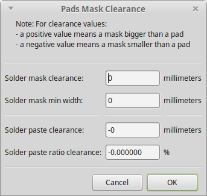
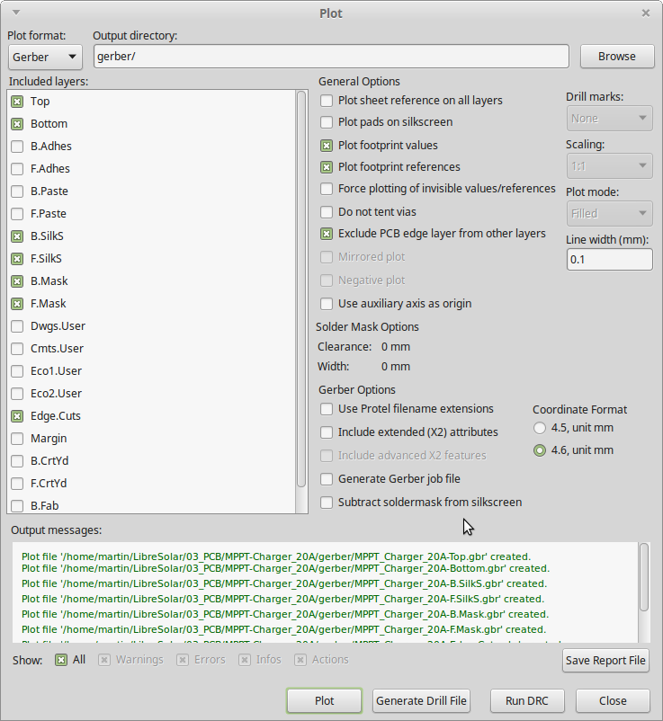
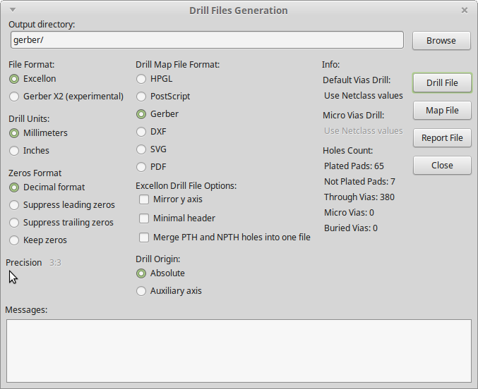

# PCB Manufacturing

**There are two options to send the manufacturing data of a PCB designed in KiCAD**:

## Native KiCAD Files

More and more PCB manufacturers accept native KiCAD board files **(extension .kicad_pcb)** which is the easiest way to get the PCB produced. Just the **.kicad_pcb file** is uploaded and then it is done.

## KiCAD Gerber File Export

The Gerber export is a little bit more complicated.

After the board is opened in Pcbnew, the solder mask clearance and min width must be set to zero. This is important because the manufacturers normally want to define the clearance themselves based on their process. Setting it to zero makes it easier for them to shrink/enlarge the pads for the solder mask. The dialogue can be found under **Dimensions > Pads to Mask Clearance** as shown in **Figure 1** below:

<figure>

    
    <figcaption><b>Figure 1.</b> Pads and Mask Clearance dialog.</figcaption>

</figure>

After that, open the Gerber export dialog under **File > Plot** and select at least the following layers for export:

* **Top** (Top copper plane)
* **Bottom** (Bottom copper plane)
* **In*X*.Cu** (Internal copper planes, if existing)
* **B.Silk** (Bottom silk screen: white plots with part names, etc.)
* **F.Silk** (Front silk screen)
* **B.Mask** (Bottom solder mask: inverted surface areas for the green paint of the PCB)
* **F.Mask** (Front solder mask)
* **Edge.Cuts** (Margins where the PCB should be cut by milling)

Select a folder where your files should be saved and press **Plot**:

<figure>

    
    <figcaption><b>Figure 2.</b> Gerber Export Settings.</figcaption>

</figure>

After sucessful export, press **Generate Drill Files**. Then select the same output directory and make sure that **Merge PTH and NPTH holes into one file** is not checked. Otherwise, your manufacturer doesn't know which holes are copper plated or not.

<figure>

    
    <figcaption><b>Figure 3.</b> Drill Files Generation.</figcaption>

</figure>

After that you should have all files necessary for the PCB production. **Compress all the files (gerber and drill files) to a .zip file and send them to the manufacturer**.
