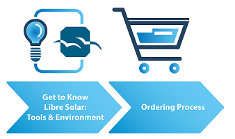

# Roadmap

## Preparation at Home

Getting to know the environment and the tools is necessary in order to complete the production process where all the needed data can be found as mentioned below in **Figure 1**.

<figure>

    
    <figcaption><b>Figure 1.</b> Roadmap at Home.</figcaption>

</figure>

## Execution at Fablab/ Workshop

    
    <figcaption><b>Figure 2.</b> Roadmap Step-by-Step Guide.</figcaption>

</figure>

The process is then followed by the steps mentioned in **Figure 2**. The first step (ordering process) can be done at home. For further steps, some specific machines and tools are needed.
