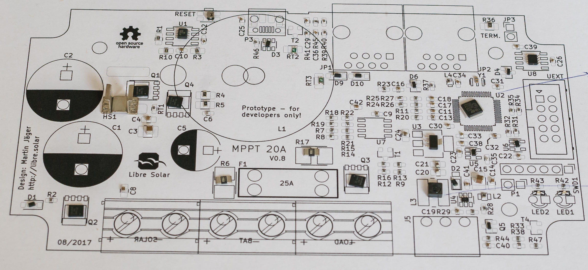
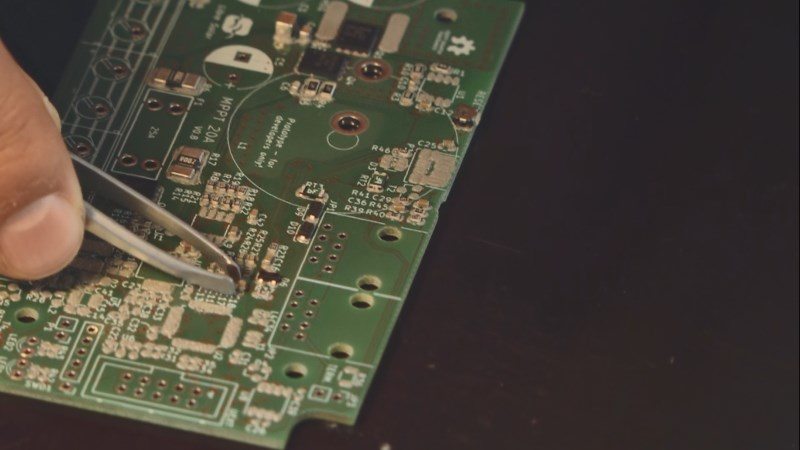
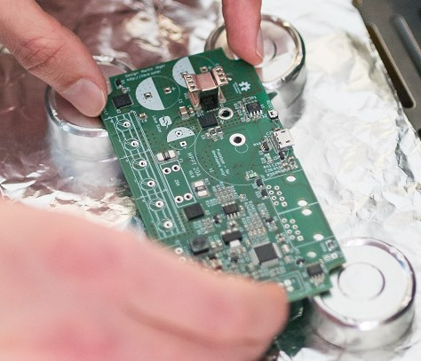
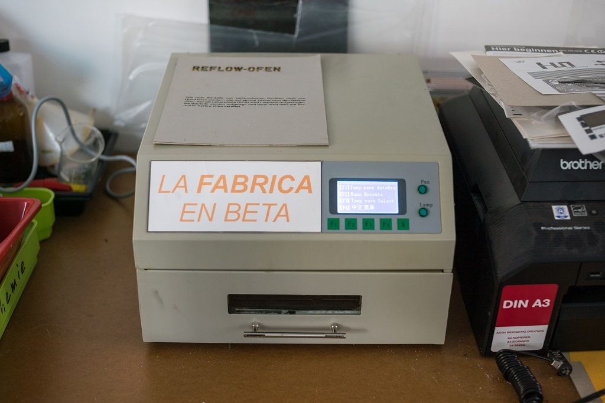

# SMD Soldering

<table class="tg">
  <tr>
    <td class="tg-yw4l">Material</td>
    <td class="tg-yw42">Solder paste</td>
  </tr>
  <tr>
    <td class="tg-rmb8">Tools</td>
    <td class="tg-rmb9">Spreader, Stencil</td>
  </tr>
  <tr>
    <td class="tg-yw4l">Needed Skills </td>
    <td class="tg-yw42">Patience</td>
  </tr>
  <tr>
    <td class="tg-rmb8">Time</td>
    <td class="tg-rmb9">circa 15 minutes</td>
  </tr>
</table>

<video width="555" height="400" align="center" controls>
  <source src="./videos/rakeln.mp4" type="video/mp4">
    Your browser does not support the video tag.
</video>

## Solder Paste Application

**With the created stencil, it is possible to apply solder onto the whole PCB in a few steps:**

1. Fix the previously prepared stencil on the PCB with adhesive tape so it cannot shift out of place.
2. Apply some solder on top the stencil.
3. Finally spread the solder evenly onto the PCB so every solder joint is coated with a good amount of solder. On the same time try not to apply too much solder so solder bridges can be avoided as much as possible.

<figure>

    
    <figcaption><b>Figure 1. </b>Applying solder onto the PCB</figcaption>

</figure>

## Pick and Place

<table class="tg">
  <tr>
    <td class="tg-yw4l">Material</td>
    <td class="tg-yw42">Blue print of PCB, Solder paste</td>
  </tr>
  <tr>
    <td class="tg-rmb8">Tools</td>
    <td class="tg-rmb9">Magnifying glasses, tweezers</td>
  </tr>
  <tr>
    <td class="tg-yw4l">Needed Skills </td>
    <td class="tg-yw42">Good eye sight and firm hands</td>
  </tr>
  <tr>
    <td class="tg-rmb8">Time</td>
    <td class="tg-rmb9">circa 60 minutes</td>
  </tr>
</table>

<video width="555" height="400" align="center" controls>
  <source src="./videos/equip_electr_parts.mp4" type="video/mp4">
    Your browser does not support the video tag.
</video>

Once the solder paste is applied to the PCB base, the electronic components placement is proceeded.

**The difference between the PCB with soldermask yet without electrical parts and the PCB with electrical parts is shown below.**

<iframe src="https://h5p.org/h5p/embed/191468" width="1091" height="617" frameborder="0" allowfullscreen="allowfullscreen"></iframe>

### Reading the PCB Layout

Since there is a long list of components to be placed, it is easier to organize them in orderly fashion. For example, starting with resistors of one class and then by referring the items list as shown below.

<figure>

    
    <figcaption><b>Figure 2. </b>Reading the Blue print of PCB layout</figcaption>

</figure>

<figure>

    
    <figcaption><b>Figure 3. </b>Reading the Blue print of PCB layout</figcaption>

</figure>

### Components Placement

The electronic components are picked up with the help of tweezers and then placed on the PCB layout. For precision, a magnifier lens can be used. Careful observation for the components orientation is a must.

<figure>

    
    <figcaption><b>Figure 4. </b>Tweezers at work</figcaption>

</figure>

### Inspection before Proceeding to Reflow Oven

Once the step is completed, an inspection can be done to see the pins which are seated on the respective markings.

<figure>

    
    <figcaption><b>Figure 5. </b>Reading the Blue print of PCB layout</figcaption>

</figure>

## Reflow Oven

<table class="tg">
  <tr>
    <td class="tg-yw4l">Material</td>
    <td class="tg-yw42">Gloves for safe handling</td>
  </tr>
  <tr>
    <td class="tg-rmb8">Tools</td>
    <td class="tg-rmb9">Reflow oven, 4 thermally insulated leg ends</td>
  </tr>
  <tr>
    <td class="tg-yw4l">Needed Skills </td>
    <td class="tg-yw42">Operation of reflow oven</td>
  </tr>
  <tr>
    <td class="tg-rmb8">Time</td>
    <td class="tg-rmb9">circa 10 minutes</td>
  </tr>
</table>

The ***Reflow Oven*** is suitable for fast soldering of entire boards in one go when working with so-called surface **mounted devices (SMD)**.
Typically used for very small electronic components, as they are processed in the automated production of industrial robots.
Soldering SMDs by hand is hard and time-staking. It can be done in 5-10 mins with the reflow oven.

<figure>

    
    <figcaption><b>Figure 6. </b>First look of re-flow oven</figcaption>

</figure>

### Reflow Oven Process

This process starts once the components are physically placed on top of the PCB board and glued with the help of thermal paste with the help of magnifying lens.

The oven has a four pre-programmed temperature curves -also called as wave- which are selected based on the type of solder material and the thermal limits of the components used. For this purpose, the **curve no. 2** was chosen to fit our criterion.

Once the casing is closed and the oven is started, one can see the moving point on the temperature curve to know the status of the process. This process typically lasted for 7 mins and a beep sound was heard at the end of it.

<figure>

    
    <figcaption><b>Figure 7. </b>Placing the BMS Inside the Reflow Oven</figcaption>

</figure>

### Board Optical Evaluation

Since the electronic components were seated manually over the PCB, there is a high probability of human error. The component was placed under optical evaluation using a microscope to check displaced contacts or the pins are inline with the sockets.

If an error is found, the electronic components are electronically unseated and soldered onto an appropriate position.

<figure>

    
    <figcaption><b>Figure 8. </b>Setting the Power Curve - Wave 2</figcaption>

</figure>
