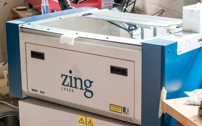
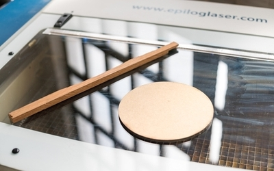
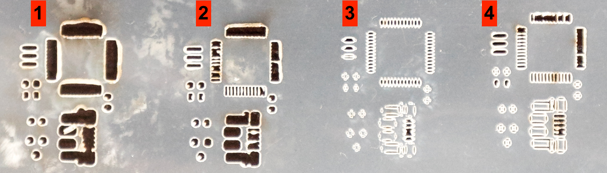

# Stencil Creation

## Self-made Stencils

<table class="tg">
  <tr>
    <td class="tg-yw4l">Material</td>
    <td class="tg-yw42">Coated paper (eg. glossy magazine, Mylar or other)</td>
  </tr>
  <tr>
    <td class="tg-rmb8">Tools</td>
    <td class="tg-rmb9">Laser cutter, KiCAD</td>
  </tr>
  <tr>
    <td class="tg-yw4l">Needed Skills </td>
    <td class="tg-yw42">Basic PC knowledge, handling of laser cutter</td>
  </tr>
  <tr>
    <td class="tg-rmb8">Time</td>
    <td class="tg-rmb9">circa 60 minutes</td>
  </tr>
</table>

<video width="555" height="400" align="center" controls>
  <source src="./videos/stencil.mp4" type="video/mp4">
    Your browser does not support the video tag.
</video>

### Production Process

The following steps should be done in a Fablab where the materials and tools such as a laser cutter can be found.

Before fitting all the small electronic parts on to the PCB, soldering must be applied first. In this chapter, the steps to create a reusable stencil is explanined which can be later used to spread solder onto the whole board.

Instead of applying solder manually to every solder joint, a laser cutter is used to create a stencil which can be reused in case more than one PCB is produced. The stencil is then fixed on the board so that the junction only is soldered with nothing else. Afterwards, solder is spread over the board which is explained in more details in the [SMD Soldering Chapter](smd.md).

<figure>

    
    <figcaption><b>Figure 1.</b> Fitting the Stencil onto the PCB</figcaption>

</figure>

### Laser Cutter Preparation

A **Laser Cutter** uses a focused high power laser to cut materials or engrave surfaces. Similar to a 3D printer or a CNC machine the laser beam is moved along two axes by a motion controller. There are software tools that generate motion commands from different file formats, in our case we use the open source software [VisiCut](http://hci.rwth-aachen.de/visicut-download) to use the laser cutter ***Epilog Zing***.

<figure>

    
    <figcaption><b>Figure 2.</b> Epilog Zing Laser Cutter</figcaption>

</figure>

<figure>

    
    <figcaption><b>Figure 3.</b> Epilog Zing Laser Cutter (with materials)</figcaption>

</figure>

The two most important parameters to determine if only the surface of a material is engraved or if the material is cut through are:

* **Power of the laser beam**
* **Speed of the beam**

The higher the power of the beam and the longer the beam stays at one place, the deeper the beam cuts into the material. If the parameters are not correct, the beam won't cut through the material or even burn the material. Also note that different materials need different parameters to achieve the desired cut or engrave. Tests showed that coated paper from glossy magazines or a material called ***Mylar*** are a good choice for laser cutting the stencil. To find the right parameters for laser cut machine you need to perform some test cuts with different power and speed settings. Use the [laser cutter template](./images/lasercut_test.svg) to conduct some tests by varying speed and power with a piece of material of your choice. A test scenario could look like this:

1. **10% power, 100% speed**
2. **5% power, 100% speed**
3. **4% power, 100% speed**
4. **4% power, 50% speed**

<figure>

    
    <figcaption><b>Figure 4. </b>Laser Cutting Test with Different Parameters</figcaption>

</figure>

In this example, the parameter set of **test no. 2** was used to laser cut the stencil. In **test no. 1**, the fine bridges on the left side of the test cut are connected due to too much power. **Tests no. 3 and 4** show that the power was not high enough to cut through some spots of the material.

### KiCAD SVG export

The stencil can be created by exporting an image in SVG file format from the KiCAD board file. The process is analog to exporting a gerber file explained [in the PCB production tutorial](pcbs.md).

The new file is a vectorized graphic in SVG file format. The file can also be opened and modified if needed with image processing tools like [Gimp](https://www.gimp.org) or [Inkscape](https://inkscape.org). The parameter settings obtained from the test cuts are then used to create the stencil. The small spots where the laser didn't cut through the material can be repaired using a knife.

## Stainless Steel Stencils
