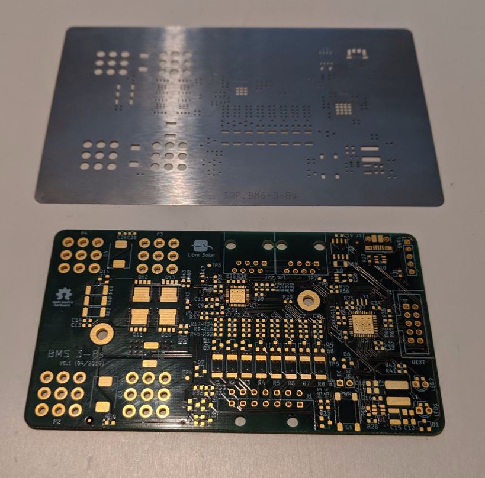

# Stencil

The stencil is used to apply solder paste for surface-mount devices to the pads of the PCB. Stencils from plastic materials such as Mylar can be produced in a fablab using a laser-cutter. However, professional stainless steel stencils offer better quality and can often be ordered together with the PCB from the same manufacturer. So the effort for self-made stencils might not be worth it.

This chapter explains how to produce or order a stencil, which will afterwards be used in the [SMD soldering chapter](smd.md) to apply the solder paste.

## Plastic (self-made)

A **laser cutter** uses a focused high power beam to cut materials or engrave surfaces. Similar to a 3D printer or a CNC machine the laser beam is moved along two axes by a motion controller.

Below video shows the stencil cutting process using a 60 W Epilog Zing laser cutter.

<video width="555" align="center" controls>
    <source src="./videos/stencil.mp4" type="video/mp4">
    Your browser does not support videos.
</video>

The following paragraphs provide some details about suitable file formats, materials and laser cutter settings.

### SVG file preparation

Most laser cutters accept SVG format, which can be exported by most PCB design software. In KiCad, the process is analog to exporting a gerber file as explained in the [PCB production chapter](pcbs.md).

The new file is a vectorized graphic in SVG file format. It can be opened and modified if needed with standard vector graphics processing tools like [Inkscape](https://inkscape.org).

In order to be used by the laser cutter, the SVG file must be converted into machine code. For mentioned Epilog Zing, the open source software [VisiCut](http://hci.rwth-aachen.de/visicut-download) can be used.

### Suitable materials

There are some suppliers for custom-made laser-cut stencils from Mylar material. This material has a comparatively high melting point and is quite thin. However, we didn't find ideal settings during testing to avoid melted corners around the pads, as shown in Figure 1.

The two most important parameters to determine if only the surface of a material is engraved or if the material is cut through are:

* Power of the laser beam
* Speed of the beam

The higher the power of the beam and the longer the beam stays at one place, the deeper the beam cuts into the material. If the parameters are not correct, the beam will not cut through the material or even burn the material. Also note that different materials need different parameters to achieve the desired cut or engrave. Tests showed that coated paper from glossy magazines or a material called **Mylar** are a good choice for laser cutting the stencil. To find the right parameters for laser cut machine you need to perform some test cuts with different power and speed settings. Use the [laser cutter template](./images/lasercut_test.svg) to conduct some tests by varying speed and power with a piece of material of your choice. The following parameters were used in the test shown in Figure 1:

1. 10% power, 100% speed
2. 5% power, 100% speed
3. 4% power, 100% speed
4. 4% power, 50% speed

<figure>

    
    <figcaption><b>Figure 1.</b> Laser cutting test with different parameters for Mylar material.</figcaption>

</figure>

In this example, the parameter set of test no. 2 was used to laser cut the stencil. The final result is shown in Figure 2.

In test no. 1, the fine bridges on the left side of the test cut are connected due to too much power. Tests no. 3 and 4 show that the power was not high enough to cut through some spots of the material.

<figure>

    
    <figcaption><b>Figure 2.</b> Fitting the Stencil onto the PCB</figcaption>

</figure>

As an alternative material for only 1-2 PCBs, coated cardboard paper can be used.

Before testing alternative materials, make sure they are suitable for laser-cutting in general and don't create harmful gases when they are burnt.

## Stainless steel

Stainless steel stencils offer much tighter tolerances than self-made plastic stencils and are recommended for assemblies with small pin pitch parts.

Figure 3 shows a stainless stell stencil together with the matching Libre Solar BMS board.

<figure>

    
    <figcaption><b>Figure 3. </b>Stainless Steel Stencil</figcaption>

</figure>
