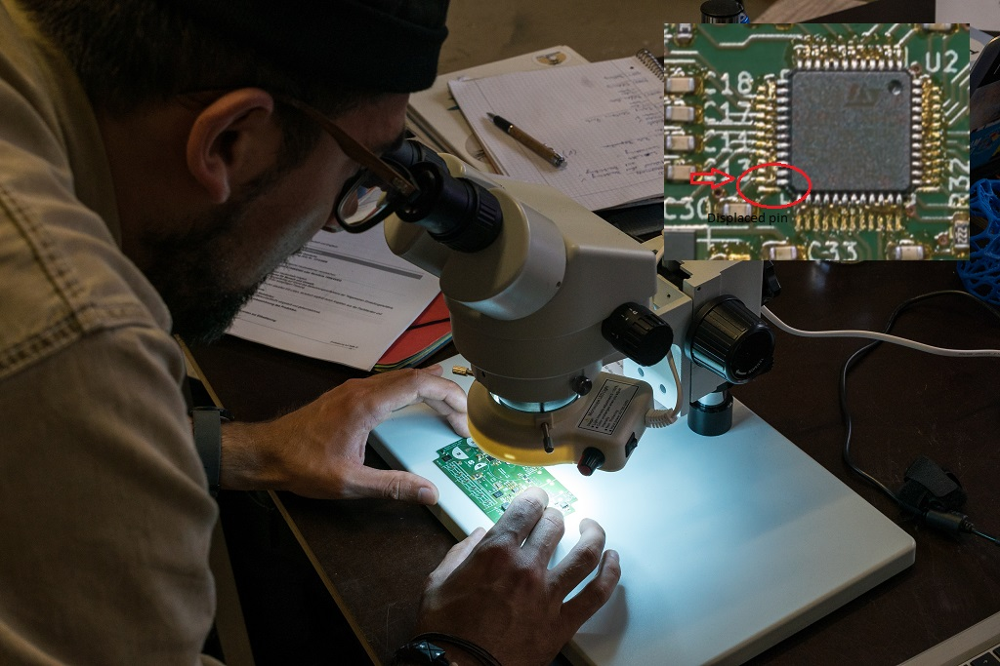
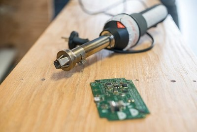
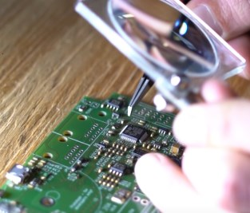
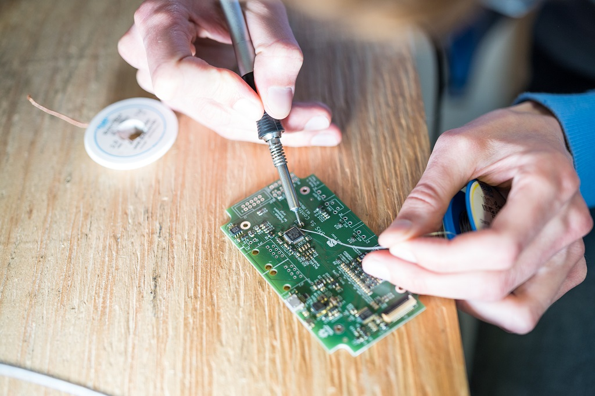

# THT Soldering

<table class="tg">
  <tr>
    <td class="tg-yw4l">Material</td>
    <td class="tg-yw42">Soldering wick, Rosin core</td>
  </tr>
  <tr>
    <td class="tg-rmb8">Tools</td>
    <td class="tg-rmb9">Heat gun, Magnifying glass, Soldering gun</td>
  </tr>
  <tr>
    <td class="tg-yw4l">Needed Skills </td>
    <td class="tg-yw42">Good eye sight and firm hands</td>
  </tr>
  <tr>
    <td class="tg-rmb8">Time</td>
    <td class="tg-rmb9">circa 2 minutes for each irregular component</td>
  </tr>
</table>

**Caution: Using handgloves during the usage time is mandatory!**

The PCB with and without THT (**T**hrough **H**ole **T**echnique) parts is shown below:

<iframe src="https://h5p.org/h5p/embed/219827" width="1091" height="614" frameborder="0" allowfullscreen="allowfullscreen"></iframe>

## Irregularities Identification

In the picture shown below, the identified displaced components will lead to component malfunction and short-circuits. The magnifying lens is used to thoroughly check other parts on the board for irregularities.

<figure>

    
    <figcaption><b>Figure 1. </b>Common displaced electrical contacts</figcaption>

</figure>

## Irregularities Removal

Using the **Heat Gun**, the soldering is removed from the applied area. Also, soldering wick can be used to de-solder the joints.

<figure>

    
    <figcaption><b>Figure 2. </b>Using Heat Gun</figcaption>

</figure>

<figure>

    
    <figcaption><b>Figure 3. </b>Re-soldering</figcaption>

</figure>

## Soldering with Rosin Core & Wick

Now that the components are placed correctly and soldered with the help of rosin core. Soldering wick can also be used to avoid contacts between successive pins.

<figure>

    
    <figcaption><b>Figure 4. </b>Re-soldering</figcaption>

</figure>

The [Testing Chapter](visual_check.md) is then proceeded, where thorough check is done on electrical contacts and short circuits.
