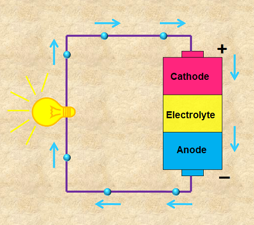

# Battery

Battery can be metaphorized as a container that is slowly filled with liquid. the amount of liquid that the container can hold is corresponding to the amount of energy the battery can store, the battery then runs for some period of time, gradually loses the stored energy and eventually expires since it is highly customized for specific customers needs.

This chapter provides the necessary basics of electrical batteries in order to understand their usage in a DC energy system.
For more detailed information about batteries,the excellent  [Battery University](https://batteryuniversity.com/) website is highly recommended.

## Working principle

 Battery is a power device for energy conversion and storage. it converts stored chemical energy into electrical energy through a reaction. Battery consists of a cathode (+) and an anode (-) terminals made of different chemicals called electrodes and a chemical medium separating these terminals called electrolyte.

The working principle of battery is shown in the following figure and explained below

<figure>

    
    <figcaption><b>Figure 1.</b> Basic principle of battery. [1]</figcaption>

</figure>

 When the battery is connected to an external circuit, such as a lamp, a chemical reaction within the battery occurs results in building up excess of electrons. This causes an electrical difference between the anode and the cathode. The electrolyte  ensures that the extra electrons are not displaced directly to the cathode. the electrons then flow through the external circuit to the cathode, In other words, the electric current starts flowing from anode to cathode which in return provides power to any appliance placed along the way.

## Types of batteries

Batteries can be classifed into two main categories; non-rechargeable (primary) and rechargeable (secondary). **Primary batteries** are normally intended for single-use and can not be recharged once depleted. these types of batteries are not eco-friendly. However, they generally store more energy and last longer than rechargeable batteries of same size [2]. The most common primary batteries are Zinc-carbon, Alkaline and Lithium, while the **secondary batteries** can be charged, discharged into a load and recharged for many cycles. The most common are Lead-Acid, Lithium-ion, Nickel-Metal Hydride and Nickel Cadmium.

### Lead-acid

Lead-acid battery is the first rechargeable system used commercially, commonly used in the solar industry. The charging method is straightforward. However, it requires accurate choice of voltage limits to avoid poor performance, sulfation and corrision [3]. In addition, continuous observation must always be taken into consideration.

Lead-acid batteries can be classified into two main groups; ***Flooded (or Wet cell)*** and ***Sealed***. The latter group can be broken down into ***VRLA***, ***AGM*** and ***GEL*** which are explained below.

#### Flooded Lead-acid battery

Flooded battery is the standard and most economic on the market today. it contains a liquid sulfuric acid electrolyte which moves freely around inside the battery coating. A reaction occurs between the battery acid and lead plates during the charging process and electric energy is stored.
In order to reach the optimum lifespan, they need to be upright to work properly and the user must frequently access the cells, check the levels and add distilled water as the battery dries out.

#### Sealed Lead-acid battery

Sealed battery is similar to to the flooded type with a slight modification. The electrolyte is sealed, the user has no access to the inside encasement anymore and the manufacturer is responsible for the number of battery cycles and ensures enough amount of acid capable of sustaining the chemical reaction throughout the warranty period.

***VRLA or Valve Regulated Lead Acid*** is a general term for sealed lead-acid battery that consists of a valve that controls the whole mechanism of releasing the gases from the battery during charging. The valve is closed in normal conditions which allows the recombination of the hydrogen and oxygen gases produced and preventing loss of electrolyte. If the battery is fast-charging or overcharged, the valve opens and allows some gas to escape.

***AGM or Absorbed Glass Mat*** is one kind of VRLA battery,the glass matte construction allows the electrolyte to be absorbed in a thin fiberglass mat sandwiched between the lead plates. This type of battery is more proof against vibrations enhancing both the discharge and recharge efficiencies [3].
AGM batteries are fast-charging compared to the flooded versions yet costly and sensitive to over-charging. The lifespan of AGM battery is also longer than the flooded type.

***GEL*** is another kind of VRLA battery similar to the AGM battery in the sense of electrolyte suspending, yet uses a silica additive instead of the glass mat.
The major distinction between them is the rate of charging, AGM batteries can hold higher charge and discharge rates than gel ones. Gel batteries are also the most costly and sensitive among other VRLA batteries,yet suitable for very slow discharge projects.

The comparisons between lead-acid batteries are mostly extracted from the [Battery University](https://batteryuniversity.com/) website.

### Lithium-ion

::: warning TODO
- What is special about li-ion chemistry?
- Battery Management System basics
:::

### Single cells and voltage levels

The voltage of a single electrochemical cell is normally too low to be used in higher power application. If several single cells are connected in series to increase the voltage, this is called battery.

Typical 12V lead-acid batteries consist of 6 cells in series. A battery at a similar voltage using Lithium Iron-Phosphate cells needs only 4 cells, as the single cell voltage is at around 3.3V.

The following interactive graph shows the open circuit voltage (the voltage at the battery terminals without any current flow) for three different types of battery cells vs. their state of charge (SOC).

<battery-voltage-levels/>

For lithium-ion NMC cells, the open circuit voltage is a good indicator to determine the state of charge of the battery. Lead-acid batteries have a large hysteresis in the open circuit voltage, so the actual voltage measured at the terminal highly depends on whether the battery was charged or discharged before. So the SOC can only be roughly estimated. Lithium iron-phosphate cells have a very flat curve, so the voltage is almost the same at high and low SOC. Thus, additional measures for proper SOC calculation need to be implemented in a battery management system.

## Charge methods

::: warning TODO
- 2-stage, 3-stage, etc.
- Impact on lifetime
:::

### References

[1] Image by "Physics and Radio-Electronics", [link](https://www.physics-and-radio-electronics.com/blog/battery-battery-works/)

[2] Batteries explanation from "Explain That Stuff",[link](https://www.explainthatstuff.com/batteries.html)

[3] Lead-acid batteries from "Whole Sale Solar", [link](https://www.wholesalesolar.com/blog/lead-acid-battery-comparison/)