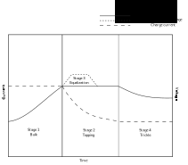

# Battery

This chapter will cover the necessary basics of electrical batteries in order to understand their usage in a DC energy system. For more detailed information the excellent [Battery University website](https://batteryuniversity.com/) is highly recommended.

## Working Principle

The battery stores chemical energy and can convert it to electrical energy through a reaction. It consists of a **cathode (+)** and an **anode (-)** and an **electrolyte** medium in between.

<figure>

    
    <figcaption><b>Figure 1.</b> Basic principle of a battery.</figcaption>

</figure>

When a consumer such as a lamp or a resistor is connected to the battery, electrons flow from the negative terminal through the consumer to the positive terminal of the battery. This is the opposite direction of the technical current flow direction, which goes from positive to negative portential.

The electrolyte inside the battery allows exchange of ions necessary for the chemical reaction in the electrodes, but it blocks direct electron flow from the anode to the cathode.

## Types of Batteries

Batteries can be classifed into two main categories: non-rechargeable (primary) and rechargeable (secondary). **Primary batteries** are normally intended for single-use and can not be recharged once depleted. However, they generally store more energy and last longer than rechargeable batteries of same size. The most common primary batteries are Zinc-carbon, Alkaline and Lithium. **Secondary batteries** can be recharged many times. The most relevant types for stationary energy storage are Lead-acid and Lithium-ion, which will be explained in detail below.

### Lead-acid

Because of their relatively simple design and worldwide availability, lead-acid batteries still have a significant market share for stationary energy storage despite their disadvantages compared to Lithium-ion batteries.

The different types of lead-acid batteries are explained below.

#### Flooded lead-acid battery

The **flooded** or **wet** battery is the oldest type of lead-acid batteries and not very common anymore. It contains a liquid sulfuric acid electrolyte which moves freely around inside the battery encasement. A reaction occurs between the battery acid and lead plates during the charging and discharging process.

They need to be installed upright in order to make them work properly and avoid leakage of electrolyte. For optimum lifespan, the user must frequently access the cells, check the acid levels and add distilled water as the battery dries out.

#### Valve-regulated lead-acid (VRLA) batteries

In contrast to the flooded type, VRLA batteries don't have a liquid electrolyte. It is instead either a gel or absorbed in a glass mat (AGM). The battery enclosure is **sealed** and contains a valve that is closed under normal conditions. This allows the recombination of the hydrogen and oxygen gases produced and prevents the loss of electrolyte, so the batteries are **maintainance-free**. If the battery is fast-charging or overcharged and pressure builds up inside the battery, the valve opens and allows some gas to escape.

- **Gel** batteries use a silica additive to convert the previously wet electrolyte into a gel and immobilize it. In contrast to wet batteries, gel batteries don't need to be installed upright anymore and prevent any electrolyte spillage. Chemically, these batteries are still quite similar to flooded lead-acid batteries and don't offer much better performance.

- **Absorbed Glass Mat (AGM)** batteries are the newest type of VRLA batteries. The glass mat construction allows the electrolyte to be absorbed in a thin fiberglass mat sandwiched between the lead plates. This type of battery is more proof against vibrations (important for car batteries) enhancing both the discharge and recharge efficiencies. AGM batteries allow higher currents and offer longer lifespan compared to the other lead-acid batteries.

### Lithium-Ion

The **Lithium-ion** battery has become the superior battery system on the market in recent years, mainly because of the following advantages:

- High energy density, which is important especially for mobile devices like phones and electric vehicles
- High number of charging cycles, i.e. long lifespan
- Low self-discharge rate and no memory effect, so it does not require deliberate full discharge cycles to maintain its optimum performance.

A major disadvantage of Li-ion batteries is the sensitivity to over-charging or over-discharging, which can result in catastrophic failures including thermal runaways. Hence, it requires a system that monitors its temperature, current and voltage states, protects the battery from operating outside the safe limits in addition to regulating its charging and discharging processes. This so-called **Battery Management System (BMS)** will be described in a [dedicated chapter](bms.md).

The following table gives a rough overview of different Li-ion technologies and their advantages and disadvantages.

| Chemistry       | NMC                 | NCA           | LFP          | LTO               |
|:----------------|:-------------------:|:-------------:|:------------:|:-----------------:|
| Cathode         | $LiNi_xCo_yMn_zO_2$ | $LiNiCoAlO_2$ | $LiFePO_4$   | NMC or LFP        |
| Anode           | Graphite            | Graphite      | Graphite     | $Li_4Ti_5O_{12}$  |
| Nominal voltage | 3.7 V               | 3.6 V         | 3.3 V        | 2.4 V             |
| Energy          | &CirclePlus;        | &CirclePlus;  | &CircleDot;  | &CircleMinus;     |
| Power           | &CircleDot;         | &CircleMinus; | &CirclePlus; | &CirclePlus;      |
| Lifetime        | &CircleDot;         | &CircleMinus; | &CirclePlus; | &CirclePlus;      |
| Safety          | &CircleDot;         | &CircleMinus; | &CirclePlus; | &CirclePlus;      |

For stational storage, LFP (LiFePO4) cells are very suitable due to their comparably good tolerance against overcharge and high cycle life. However, several manufacturers also use NMC cells for stationary storage, that are otherwise mainly used in electric vehicles because of their high energy density.

## Voltage Levels

The voltage of a single electrochemical cell is normally too low to be used in higher power application. If several single cells are connected in series to increase the voltage, this is called battery.

Typical 12V lead-acid batteries consist of 6 cells in series. A battery at a similar voltage using Lithium Iron-Phosphate cells needs only 4 cells, as the single cell voltage is at around 3.3V.

The following interactive graph shows the open circuit voltage (the voltage at the battery terminals without any current flow) for three different types of battery cells vs. their state of charge (SOC).

<battery-voltage-levels/>

<figure>

    <figcaption><b>Figure 2.</b> Battery voltage vs. state of charge <b>(interactive)</b>.</figcaption>

</figure>

For lithium-ion NMC cells, the open circuit voltage is a good indicator to determine the state of charge of the battery. Lead-acid batteries have a large hysteresis in the open circuit voltage, so the actual voltage measured at the terminal highly depends on whether the battery was charged or discharged before. So the SOC can only be roughly estimated. Lithium iron-phosphate cells have a very flat curve, so the voltage is almost the same at high and low SOC. Thus, additional measures for proper SOC calculation need to be implemented in a battery management system.

## Charge Methods

A good selection of the charging technique will prolong the service lifetime of the batteries, optimize their performance and prevent fatal damages.

### Four-stage battery charging

The charging method with four different stages is only used for lead-acid batteries. Li-ion battery charging is more simple and use only two of the four stages. Figure 3 shows the voltage and current for an entire charging cycle with three or four stages, which will be explained below.

<figure>

    
    <figcaption><b>Figure 3.</b> Four battery charging stages.</figcaption>

</figure>

#### 1. Bulk stage

This first charging stage adds about 70 percent of the stored energy. The battery is charged with a constant current (**CC**), typically the maximum current the charger can supply. In case of a solar charge controller, this is where the **Maximum Power Point Tracking (MPPT)** takes place. As a result, the terminal voltage increases until the peak charge voltage limit is reached and topping phase is entered.

#### 2. Topping stage

During the **topping** (sometimes also called **boost** or **absorption**) the remaining 30 percent of the energy is continued being charged at a constant voltage (**CV**) while gradually decreasing the charge current until the battery is fully charged.

#### 3. Equalization stage

An additional **equalization** charging is beneficial for flooded lead-acid batteries only. It can be considered as a periodic controlled overcharge that brings the cells to the same charge level and removes the sulphation by increasing the voltage to a higher value than the peak charge voltage limit. The current during equlization is controlled at a very low value.

#### 4. Trickle stage

The **trickle** or **float** charging stage is the final phase upon the completion of the absorption or equalization phase which maintains the battery at full charge. During this stage, the charge voltage is reduced and held constant. The current reduces to a very low value.

### Two-stage charging (CC-CV)

While **lead-acid batteries** are charged in 3- or 4-stage profiles, **Lithium-ion batteries** only go through the bulk and topping charging stages. In the context of Lithium-ion batteries, these two stages are called constant-current (CC) and constant-voltage phases (CV). After the current in the CV phase reached a cut-off threshold, the charging is switched off completely until the voltage drops below a certain recharge threshold.

### Charging Voltages

The following table gives an overview of the target voltages of the different charger stages for different types of 12V batteries. The voltage in brackets is the corresponding single-cell voltage).

| Battery Type          |   Bulk / Topping  |   Equalization    |     Trickle       |
|-----------------------|:-----------------:|:-----------------:|:-----------------:|
| Flooded (6 cells)     |  14.4 V (2.40 V)  |  15.0 V (2.50 V)  |  14.1 V (2.35 V)  |
| Gel (6 cells)         |  14.4 V (2.40 V)  |        n/a        |  13.8 V (2.30 V)  |
| AGM (6 cells)         |  14.4 V (2.40 V)  |        n/a        |  13.8 V (2.30 V)  |
| LiFePO4 (4 cells)     |  14.2 V (3.55 V)  |        n/a        |         n/a       |

<!--
#### Temperature compensation

::: warning TODO
- Temperature compensation
:::
-->
